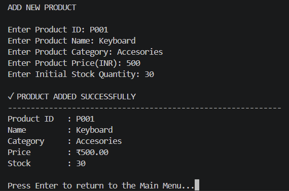
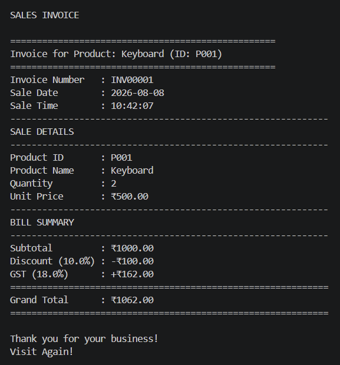
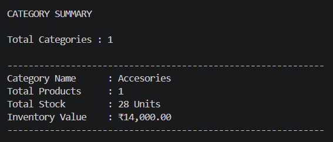
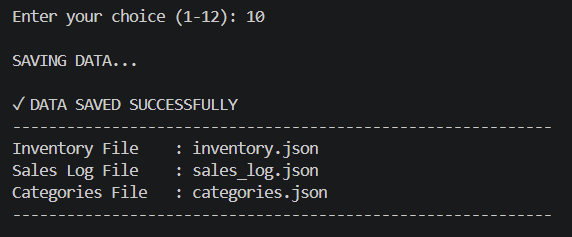

# 📦 Inventory & Sales Management System

A command-line Python application to manage product inventory,
process sales, and generate business insights — built entirely
with core Python data structures (no external libraries).


## 🎯 Overview

Small and medium retail stores often manage inventory and billing manually, leading to stock mismatches, billing errors, and no visibility into sales or restocking needs. This project addresses that gap by simulating the core operations of a small retail store — adding products, restocking, selling items with automatic discount and GST calculation, and generating business reports — all through an interactive command-line menu.

📄 See [PROBLEM_STATEMENT.md](PROBLEM_STATEMENT.md) for the full problem statement and requirements this project was built against.

## ✨ Features

- 🆕 **Add Product** — Register new products with ID, name, category, price, and opening stock
- 🔄 **Update Stock** — Restock existing products
- 💰 **Sell Product** — Sell with quantity validation, discount %, and automatic 18% GST calculation
- 🔍 **Search Product** — Search by Product ID or Product Name
- ⚠️ **Low Stock Report** — Flags products at or below a 15-unit threshold
- 📊 **Category Summary** — Category-wise product count, stock, and inventory value
- 🏷️ **Unique Categories** — Lists all distinct product categories added so far
- 📅 **Unique Products Sold Today** — Daily sales report using sets
- 🧾 **Generate Invoice** — Auto-generated invoice with subtotal, discount, GST, and grand total
- 💾 **Persistent Storage** — Inventory, sales log, and categories saved/loaded via JSON
- 🛡️ **Exception Handling** — Graceful handling of invalid input, negative values, and insufficient stock

## 🧠 Concepts Applied

| Concept | Usage |
|---|---|
| Nested Dictionaries | Core `inventory` data model (product ID → product details) |
| Dictionaries | Category summary aggregation |
| Lists | Sales log, low-stock product list |
| Sets | Unique categories, unique products sold today |
| String Methods | Search (`.lower()`), formatting (`.title()`, `.strip()`, `.upper()`) |
| Loops | Menu system (`while True`), report generation loops |
| Functions | Every feature isolated into its own function |
| File Handling | Save/load inventory, sales log, and categories as JSON |
| Exception Handling | Invalid input, insufficient stock, missing product ID |
| Modular Code Organization | Logic split across `main.py` and `inventory_manager.py` |

## 🖥️ Demo

**Main Menu**


**Add Product**


**Sell Product**


**Sales Invoice**


**Category Summary**


**Data Saving**


## 🚀 How to Run

```bash
git clone https://github.com/Yatharth-2206/Inventory-Sales-Management-System.git
cd Inventory-Sales-Management-System
python main.py
```

## 📂 Repo Structure

```
Inventory-Sales-Management-System/
├── main.py                 # Entry point - runs the menu
├── inventory_manager.py    # All core functions
├── data/
│   ├── inventory.json      # Saved inventory data
│   ├── sales_log.json      # Saved sales transactions
│   └── categories.json     # Saved unique categories
├── screenshots/            # Demo screenshots
├── README.md
└── .gitignore
```

## 🧾 Sample Workflow

1. Add a product (e.g., `P001 - Keyboard`, Category: `Accessories`, Price: ₹500, Stock: 30)
2. Sell units of the product with a discount % — GST (18%) is applied automatically
3. Generate an invoice showing subtotal, discount, GST, and grand total
4. View category-wise inventory summary and low-stock alerts
5. Save data — inventory, sales log, and categories persist as JSON for the next run

## 👤 Author

**Yatharth Aphale**
[LinkedIn](https://linkedin.com/in/yatharth-aphale-338b203b8) | [GitHub](https://github.com/Yatharth-2206)
